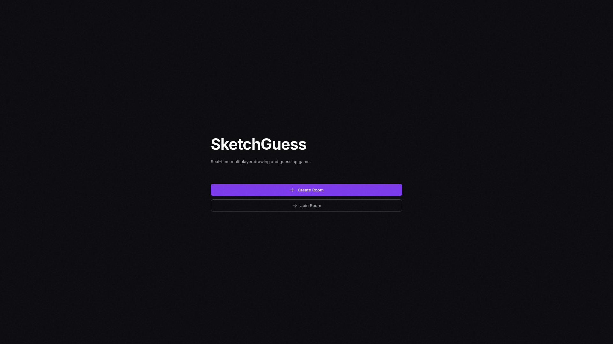
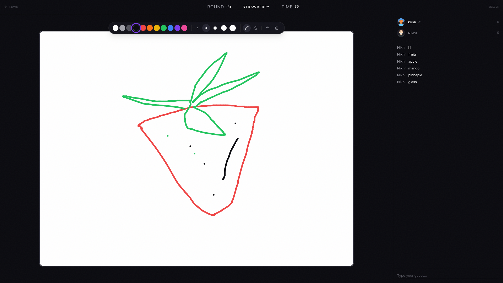
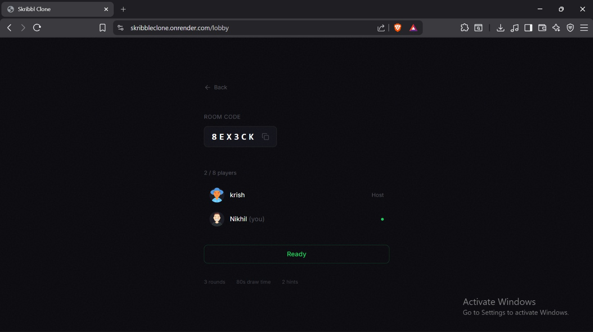
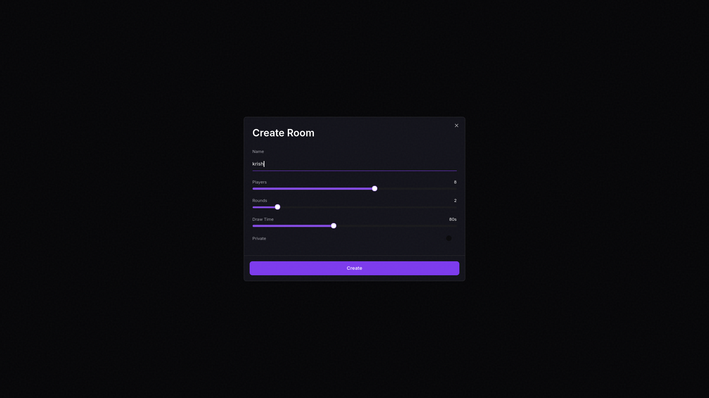

# 🎨 Skribble Clone — Real-Time Multiplayer Drawing Game

A full-stack real-time multiplayer drawing and guessing game inspired by Skribbl.io, built under a **72-hour constraint** to simulate rapid prototyping and real-world deployment.

🔗 **Live Demo**: https://skribble-clone-2f0lujkdj-veles-venices-projects.vercel.app/

---

## 🎥 Preview






---

## 🚀 Overview

This project focuses on building a **real-time multiplayer system** where multiple users can draw and guess simultaneously with minimal latency.

The emphasis was not just on UI replication, but on:

* Real-time communication
* System design under constraints
* Full-stack deployment

---

## ⚙️ Tech Stack

**Frontend**

* React (Vite)
* Socket.IO Client

**Backend**

* Hono (Node.js)
* Socket.IO Server

**Deployment**

* Frontend: Vercel
* Backend: Render

---

## 🧠 Architecture

The application is structured with a clear separation between client and server:

* **Frontend** handles UI and user interaction
* **Backend** manages game logic and real-time events
* **Communication layer** uses WebSockets (Socket.IO)

Environment variables are used to handle differences between development and production environments.

---

## 🔥 Key Features

* 🎮 Real-time multiplayer gameplay
* ✏️ Live drawing synchronization
* 🔌 WebSocket-based communication with fallback support
* 🌐 Fully deployed full-stack system
* ⚡ Fast and responsive client-server interaction

---

## ⚔️ Challenges & Learnings

### Real-Time Synchronization

Managing multiple users interacting simultaneously required careful handling of socket events and connection states.

---

### Dev vs Production Differences

Handling differences between local development (proxy-based) and production environments required environment-based configuration.

---

### Deployment & Stability

Ensuring the system works across platforms involved resolving build issues, routing inconsistencies, and connection handling.

---

## 🛠️ Local Setup

```bash
# Clone the repository
git clone https://github.com/Veles-venice/skribbleClone.git

# Install dependencies
npm install

# Run in development
npm run dev
```

---

## 🎯 What This Project Demonstrates

* Building and deploying a **real-time application**
* Understanding of **client-server architecture**
* Handling **WebSocket communication in production**
* Solving **practical issues under time constraints**

---

## 📌 Note

This project was built within a strict time limit, prioritizing:

* Core functionality
* Real-time architecture
* Deployment readiness

---

## 👤 Author

Built by Veles
